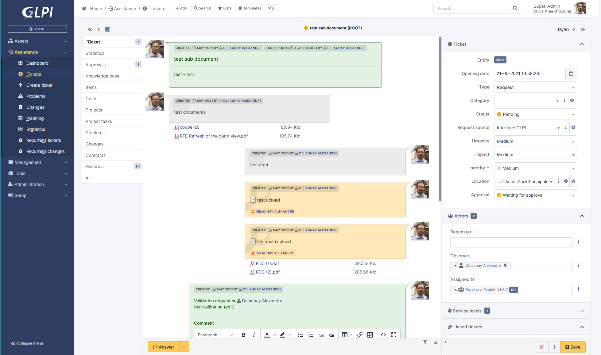
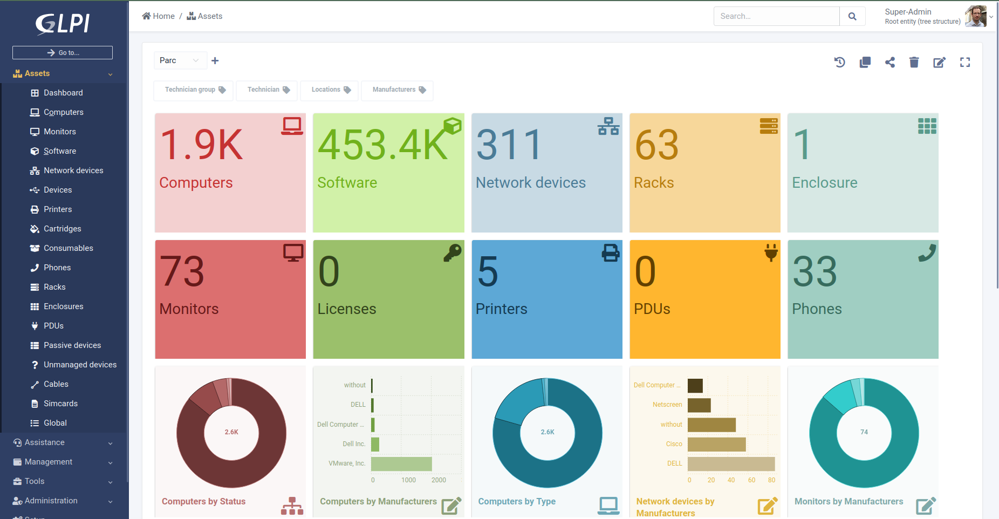

## About GLPI

GLPI stands for **Gestionnaire Libre de Parc Informatique** is a Free Asset and IT Management Software package, that provides ITIL Service Desk features, licenses tracking and software auditing.

Major GLPI Features:

* **Service Asset and Configuration Management (SACM)**: Manages your IT assets and configurations, tracks computers, peripherals, network printers, and their associated components. With native dynamic inventory management from version 10 onwards, you can maintain an up-to-date configuration database, ensuring accurate and timely information about your assets.

* **Request Fulfillment**: Streamlines request fulfillment processes, making it easy to manage service requests, incidents, and problems efficiently. This ensures that user requests are handled promptly and professionally, enhancing overall service quality.

* **Incident and Problem Management**: Supports efficient handling of ITIL's Incident Management and Problem Management processes. Ensures that issues are addressed promptly, root causes are identified, and preventive measures are taken.

* **Change Management**: Supports change management processes, enabling you to plan, review, and implement changes in a controlled and standardized manner. This helps minimize disruptions and risks associated with changes to your IT environment.

* **Knowledge Management**: Includes a knowledge base and Frequently Asked Questions (FAQ) support, facilitating knowledge management. Allows you to capture, store, and share valuable information and solutions, empowering your team to resolve issues more effectively.

* **Contract Management**: Offers comprehensive contract management capabilities, including managing contracts, contacts, and associated documents related to inventory items. Aligns with ITIL's Supplier Management process, ensuring you have control and visibility over your contracts and vendor relationships.

* **Financial Management for IT Services**: Assists in managing financial information, such as purchase orders, warranty details, and depreciation. Aligns with ITIL's Financial Management for IT Services process, helping you optimize IT spending and investments.

* **Asset Reservation**: Offers asset reservation functionality, allowing you to reserve IT assets for specific purposes or periods. Aligns with ITIL's Demand Management process, ensuring resources are allocated effectively based on demand.

* **Data Center Infrastructure Management (DCIM)**: Provides features for managing data center infrastructure, enhancing control over critical assets.

* **Software and License Management**: Includes functionality for managing software and licenses, ensuring compliance and cost control.

* **Impact Analysis**: Supports impact analysis, helping assess the potential consequences of changes or incidents on IT services.

* **Service Catalog (with SLM)**: Includes service catalog features, often linked with Service Level Management (SLM), to define and manage available services.

* **Entity Separation**: Offers entity separation features, allowing distinct management of different organizational units or entities.

* **Project Management**: Supports project management, helping organize and track projects and associated tasks.

* **Intervention Planning**: Offers intervention planning capabilities for scheduling and managing on-site interventions.

Moreover, supports many [plugins](http://plugins.glpi-project.org) that provide additional features.

## Demonstration

Check GLPI features by asking for a free personal demonstration on **[glpi-network.cloud](https://www.glpi-network.cloud)**

## License

It is distributed under the GNU GENERAL PUBLIC LICENSE Version 3 - please consult the file called [LICENSE](https://raw.githubusercontent.com/glpi-project/glpi/main/LICENSE) for more details.

## Some screenshots

**Tickets**

**DCIM**

**Assets**

**Dashboards**

## Prerequisites

* A web server (Apache, Nginx, IIS, etc.)
* MariaDB >= 10.2 or MySQL >= 5.7
* PHP (See compatibility matrix below)

    | GLPI Version | Minimum PHP | Maximum PHP |
    | ------------ | ----------- | ----------- |
    | 9.4.X        | 5.6         | 7.4         |
    | 9.5.X        | 7.2         | 8.0         |
    | 10.0.X       | 7.4         | 8.1         |
* Mandatory PHP extensions:
    - dom, fileinfo, json, session, simplexml (these are enabled in PHP by default)
    - curl (access to remote resources, like inventory agents, marketplace API, RSS feeds, ...)
    - gd (pictures handling)
    - intl (internationalization)
    - libxml (XML handling)
    - mysqli (communication with database server)
    - zlib (handling of compressed communication with inventory agents, installation of gzip packages from marketplace, PDF generation)

* Suggested PHP extensions
    - exif (security enhancement on images validation)
    - ldap (usage of authentication through remote LDAP server)
    - openssl (email sending using SSL/TLS)
    - zip and bz2 (installation of zip and bz2 packages from marketplace)

 * Supported browsers:
    - Edge
    - Firefox (including 2 latest ESR versions)
    - Chrome

Please, consider using browsers on editor's supported version

## Download

See :
* [releases](https://github.com/glpi-project/glpi/releases) for tarball packages.

## Documentation

* [GLPI Administrator](https://glpi-install.readthedocs.io)
    * Install & Update
    * Command line tools
    * Timezones
    * Advanced configuration
    * [Contribute to this documentation!](https://github.com/glpi-project/doc-install)

* [GLPI User](https://glpi-user-documentation.readthedocs.io)
    * First Steps with GLPI
    * Overview of all modules
    * Configuration & Administration
    * Plugins & Marketplace
    * GLPI command-line interface
    * [Contribute to this documentation!](https://github.com/glpi-project/doc)

* [GLPI Developer](https://glpi-developer-documentation.readthedocs.io)
    * Source Code management
    * Coding standards
    * Developer API
    * Plugins Guidelines
    * Packaging
    * [Contribute to this documentation!](https://github.com/glpi-project/docdev)

* [GLPI Agent](https://glpi-agent.readthedocs.io)
    * Installation (Windows / Linux / Mac OS / Source)
    * Configuration / Settings
    * Usage / Execution mode
    * Tasks / HTTP Interface / Plugins
    * Bug reporting / Man pages
    * [Contribute to this documentation!](https://github.com/glpi-project/doc-agent)

## Additional resources

* [Official website](http://glpi-project.org)
* [Demo](https://www.glpi-network.cloud)
* [Translations on transifex service](https://www.transifex.com/glpi/public/)
* [Issues](https://github.com/glpi-project/glpi/issues)
* [Suggestions](http://suggest.glpi-project.org)
* [Forum](http://forum.glpi-project.org)
* [Development documentation](http://glpi-developer-documentation.readthedocs.io/en/master/)
* [Plugin directory](http://plugins.glpi-project.org)
* [Plugin development documentation](http://glpi-developer-documentation.readthedocs.io/en/master/plugins/index.html)

## Support
GLPI is a living software. Improvements are continuously made, new functionalities are being developed, and issues are being fixed.

To ease support and development, we need your help when encountering issues.
There is a GLPI version typical lifecycle:
 * A new major version (9.3) is released.
 * Minor versions (9.3.x), fixing bugs or issues, are published after several weeks.
   Please consider updating to the latest released minor version if you encounter some bugs or performance issues.
 * Several months after major version released, a new major version (9.4) is released.
   Previous major versions become unsupported, please update to the new major version.
   Obviously, we provide support for the migration tools too!
